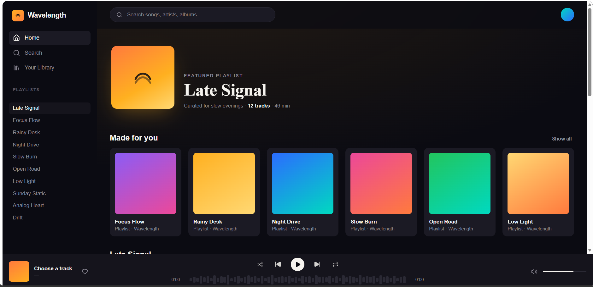

# 🎵 Wavelength Music Player

A modern Spotify-inspired music player built with **React**, **Vite**, and **Lucide React**. The application features a clean UI, audio playback controls, search, playlists, waveform progress, and a responsive layout.

---

## 📸 Preview




---

## ✨ Features

- 🎵 Music Player
- ▶️ Play / Pause
- ⏭️ Next / Previous
- 🔀 Shuffle
- 🔁 Repeat
- ❤️ Like Songs
- 🔍 Search Tracks
- 📊 Interactive Waveform
- 🔊 Volume Control
- 🎨 Spotify-inspired UI
- 📱 Responsive Layout

---

## 🛠️ Tech Stack

- React
- Vite
- JavaScript (ES6+)
- CSS3
- Lucide React

---

## 📂 Folder Structure

```
src/
│
├── components/
│   ├── Card.jsx
│   ├── Player.jsx
│   ├── Sidebar.jsx
│   ├── Topbar.jsx
│   ├── TrackRow.jsx
│   ├── VolumeSlider.jsx
│   └── Waveform.jsx
│
├── data/
│   └── tracks.js
│
├── hooks/
│   └── useAudioPlayer.js
│
├── App.jsx
├── Wavelength.jsx
├── index.css
└── main.jsx
```

---

## 🚀 Getting Started

Clone the repository

```bash
git clone https://github.com/suryabhan616/Wavelength-music-player.git
```

Go to the project folder

```bash
cd Wavelength-music-player
```

Install dependencies

```bash
npm install
```

Run the development server

```bash
npm run dev
```

Create production build

```bash
npm run build
```

---

## 📌 Future Improvements

- 🎵 Real MP3 Library
- 🖼️ Album Cover Images
- ❤️ Save Liked Songs using Local Storage
- 🔐 Firebase Authentication
- ☁️ Backend Integration
- 📱 Mobile Optimization

---

## 👨‍💻 Author

**Suryabhan**

GitHub: https://github.com/suryabhan616
